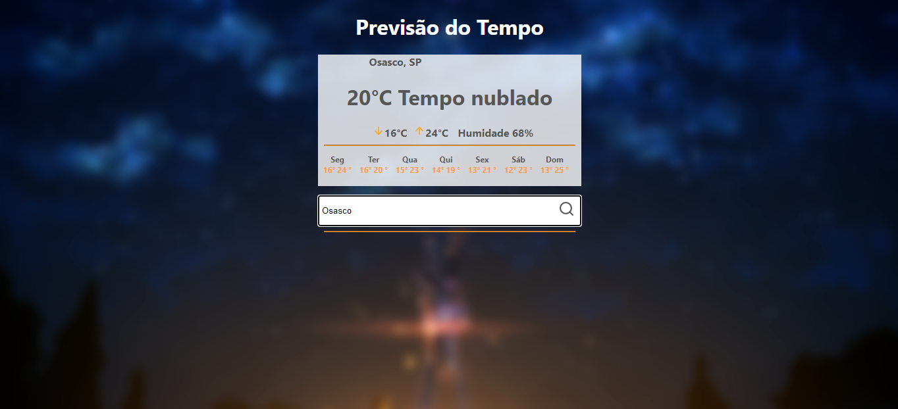

<h1 align="center">
   Previsão do Tempo
</h1>

<hr />


<div align="center">
  <sub> Criado por 
    <a href="https://github.com/TiagoSilva-Dev">Tiago Silva
  </sub>
</div>

# 📌 Conteudo

* [Screenshots](#camera-screenshots)
* [Tecnologias](#rocket-technologies)
* [How to Run](#computer-how-to-run)


# :camera: Screenshots
<div align="center" display="flex">
   
   
</div>

# :rocket: Technologies
This project was made using the follow technologies:

- [ReactJS](https://reactjs.org/)
- [Styled Icons](https://styled-icons.js.org/)
- [Axios](https://github.com/axios/axios)


# :computer: How to run

```bash
# Clone Repository
$ git clone https://github.com/TiagoSilva-dev/Previsao_do_Tempo.git && cd Previsao_do_Tempo
# Install Dependencies
$ yarn install
# Run Aplication
$ yarn start
```
